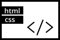
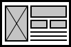

<section>
<h3>Joana Corvo</h3>

I am Joana Corvo, a Junior Product Designer with a Communication Design degree and a post-graduate student in Digital Experience Design at the Fine Arts Academy, Lisbon University. Through the past years, I have been working on projects that have made me grow as a designer, as well as a person.Besides design and art, my passions envolve music and reading. On my free time you can also catch me binge watching random videos on tecnology (right now I am learning about 3D printing!).

</section>
<figure >
                
                
                
                
            </figure>

<section>
<h3>Academic Qualifications</h3>

<em>09-09-2020 — Present</em>

<strong>Post-graduation in Digital Experience Design</strong>
Fine-Arts Faculty, Lisbon University.

<em>10-09-2017 — 15-07-2020</em>

<strong>Degree level in Communication Design</strong>
Fine-Arts Faculty, Lisbon University.

</section>

<section>
<h3>Competences</h3>

I consider myself a problem-solver and someone who is always looking forward to learn new things. I find the combination between creative work and technology to be my sweet spot!

I have had the opportunity to learn how to work with different techniques and softwares, such as Adobe Creative Cloud and Figma, and in different areas of design and art, such as editorial, graphic, interaction, illustration, animation, and many others.

Even without professional experience, I have had the opportunity to work following the same professional structure during my post-graduate studies. I have a grasp of how a project runs, the multiple steps to go through to develop a product, both from scratch and from an already existing platform. I have also learnt how to create a Design Systems, Wireframes, Prototypes and more.

<figure>

<figcaption>UX&amp;UI</figcaption>
</figure>
<figure>

<figcaption>Html &amp; CSS</figcaption>
</figure>
<figure>

<figcaption>Editorial Design</figcaption>
</figure>
<figure>

<figcaption>Video Editing</figcaption>
</figure>
<figure>

<figcaption>Illustration</figcaption>
</figure>
<figure>

<figcaption>Animation</figcaption>
</figure>

</section>
